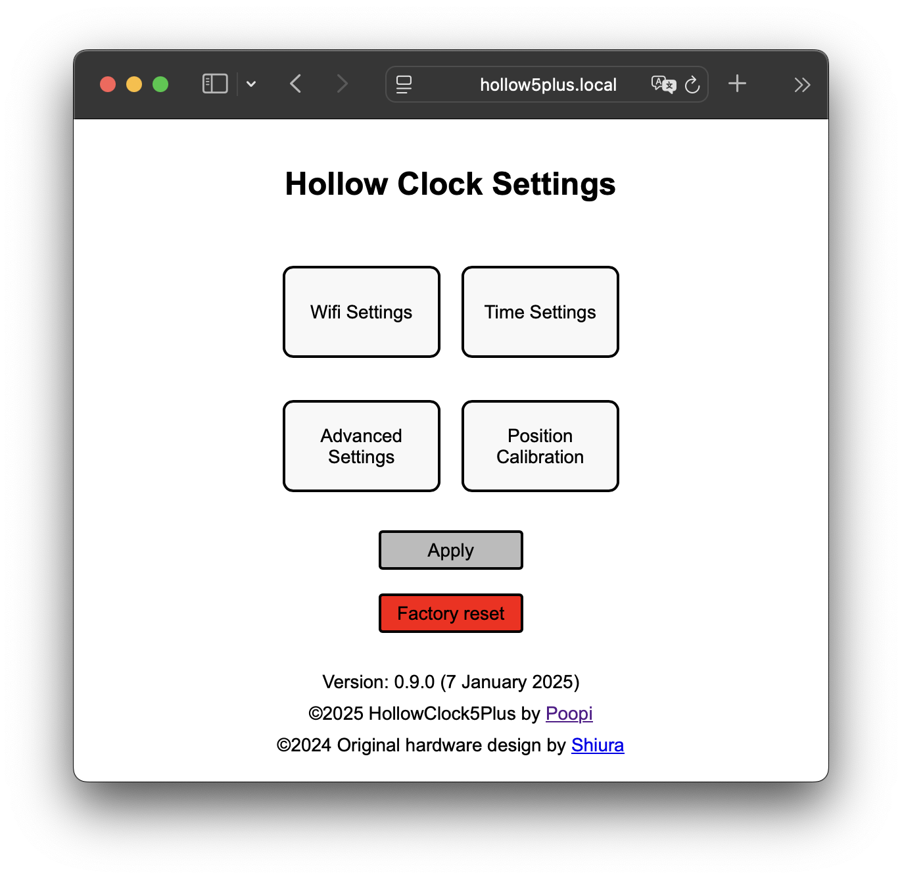
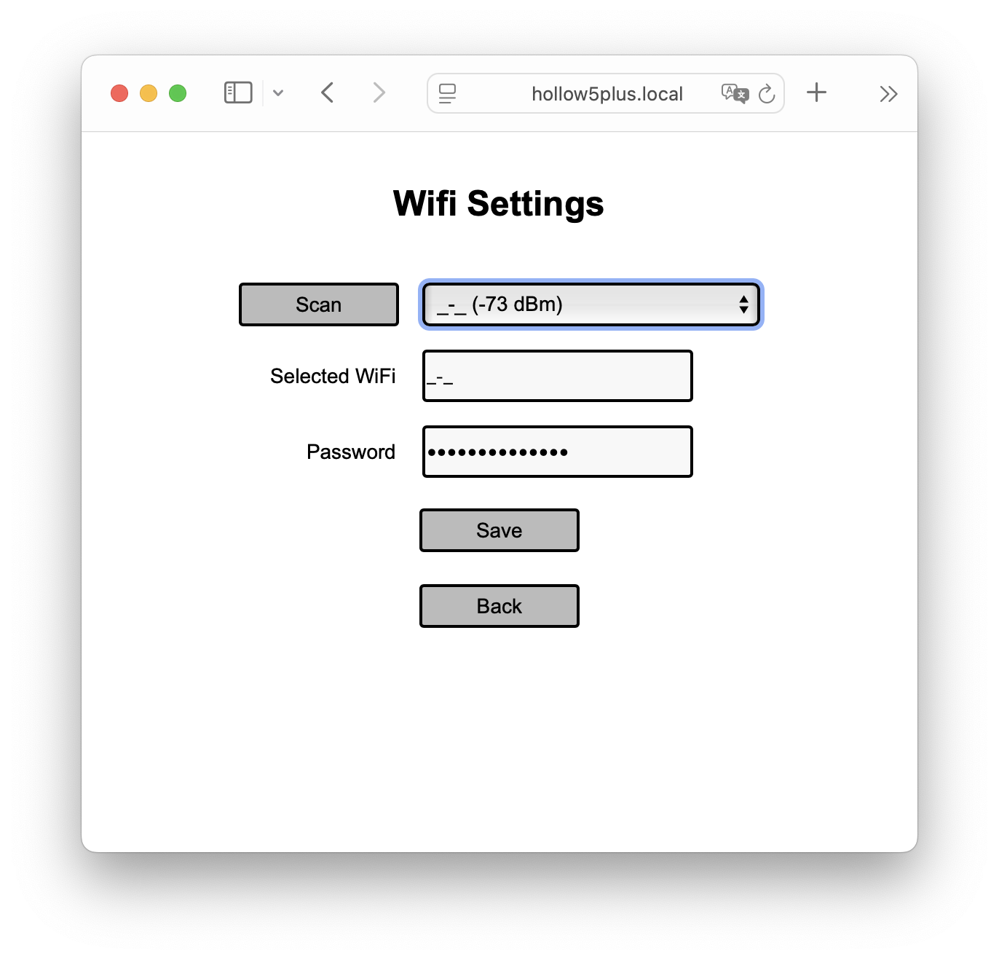
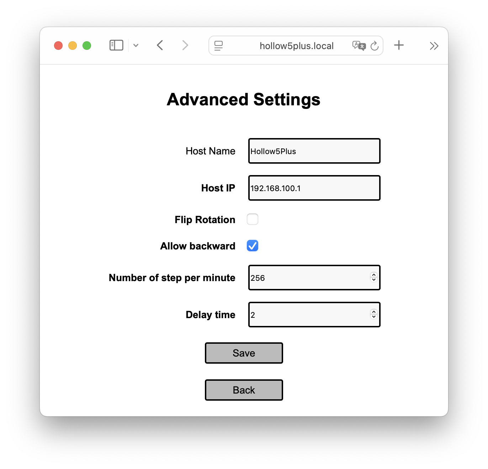
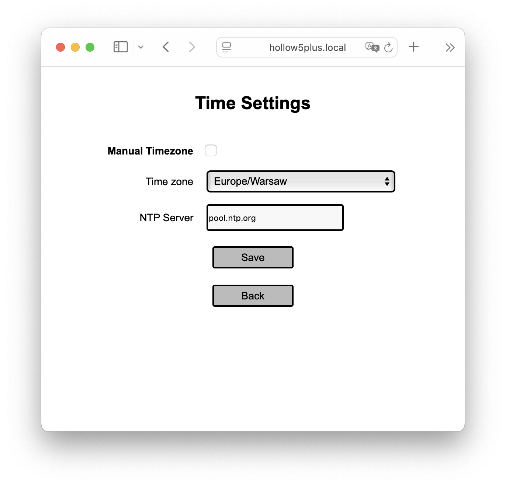
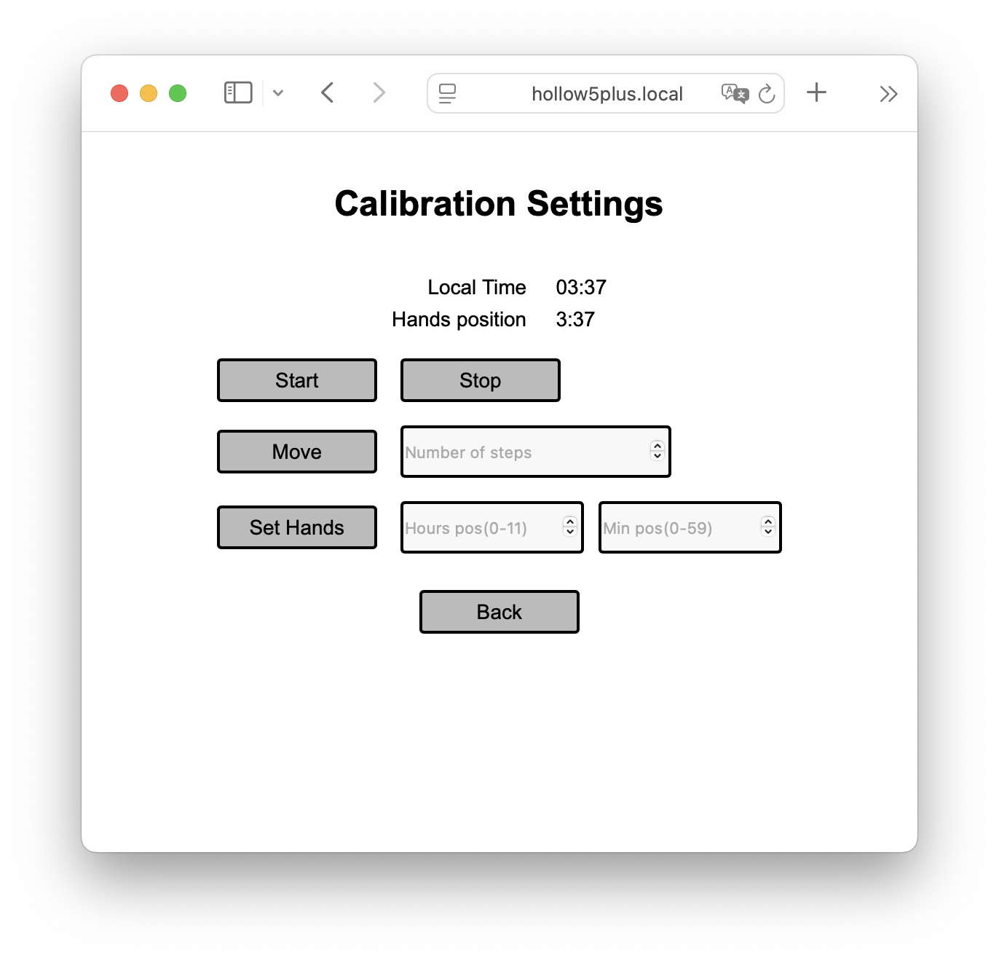

# Hollow Clock 5 Plus

The Hollow Clock 5 Plus is an ESP32-based clock with WiFi-enabled software. It’s designed to work with the Hollow Clock 5 by [Shiura](https://www.thingiverse.com/shiura).

This version of the firmware offers full configurability via WiFi. You can scan for available access points, set time zones from a list, and automate daylight saving recalibration. See the screenshot below for more details.

The original project is maintained at [here](https://www.thingiverse.com/thing:6647784).

The code has been developed for the [SeedStudio XIAO](https://www.seeedstudio.com/Seeed-Studio-XIAO-ESP32C6-p-5884.html), but other ESP-based microcontrollers should work out of the box.

[2025-01-13] New option has been added - chime sound
In addition when clock connects to the acces point it plays short music ;)

## Compile

To compile the code, follow these steps:

1. Check out the code from the repository.
2. Use the XIAO_ESP32C6 board with a 160MHz setup.
3. Create a partition scheme with a default 4MB partition and SPIFFS.

## Usage

After flashing the firmware, you’ll need to set up the hour and minute hands to a valid position, such as 0:00.

When you boot the clock for the first time, it will connect to the access point with the address 192.168.100.1 and the SSID HOLLOW5P-xxx, where xxx is a unique identifier for each device. There’s no password required.

Once connected, you can access all the settings. To apply the settings, press the APPLY button. In the calibration screen, you can set the actual position of the hands to synchronize the clock with the local time.

After a reboot, if the correct SSID and passwords are set, the clock will connect to the configured access point and be accessible via the http://hollow5plus.local address (ensure mDNS is functioning properly in the local network). This page remains accessible at all times.

Please note that if a ratchet is being installed, the “Allow backward” option should not be activated.

### Example screens

<picture>
    

        
    

</picture>

<picture>
    

        
    

</picture>

<picture>
    

        
    

</picture>

<picture>
    

        
    

</picture>

<picture>
    

        
    

</picture>

©2025 By Poopi
